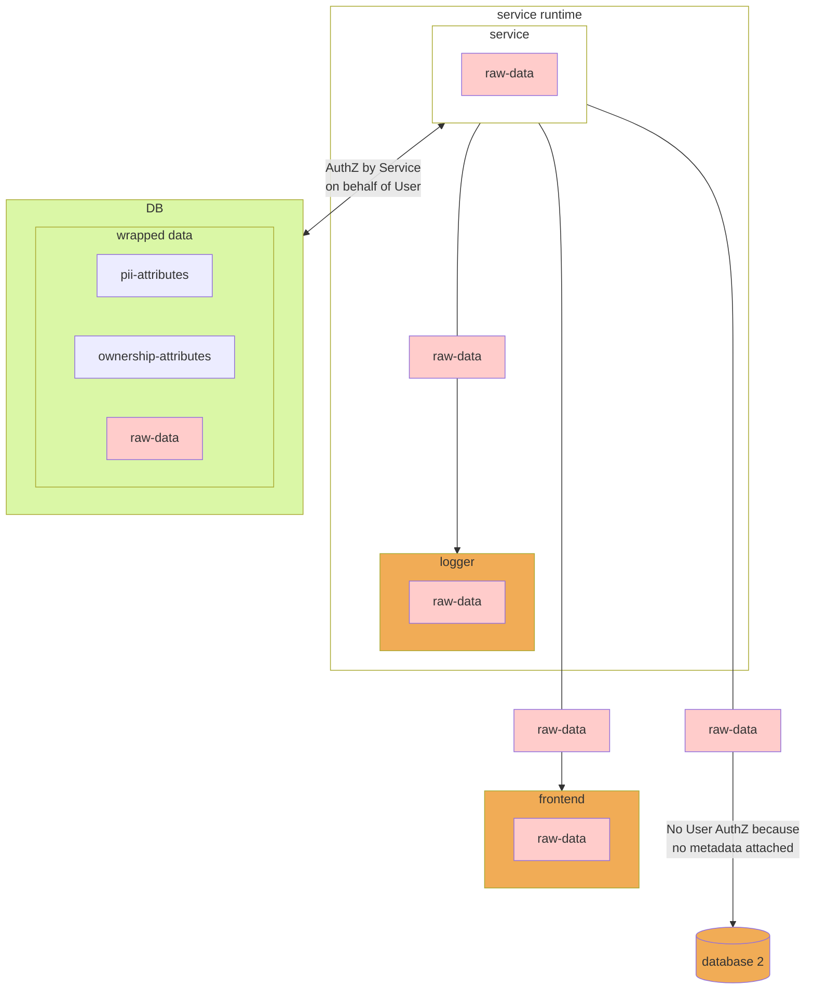
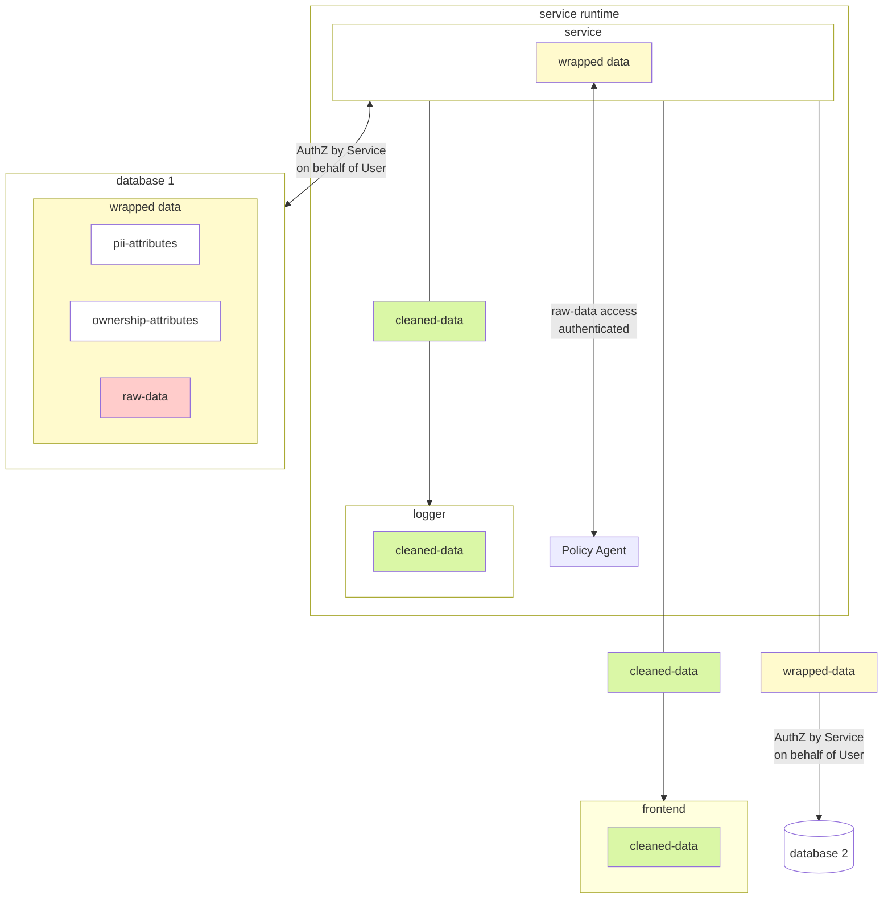

# data boxes


## Overview

**What is the problem?**

First lets take the basic example of a web application that is handling user-data:



**And, so what is the solution?**

The metadata needs to live with the data at all times! Then a policy agent can evaluate when sharing is appropriate based on the service context.


Now, any time a "step down" from `wrapped-data` to `raw-data` is needed an adapter will need to review the combination:    
`(auth context, metadata, policy)`

Examples of where this is done is before sharing to the user-interface, to the logger.
All datastores should not accept `raw-data` (unless there's some intake flow elsewhere) only `wrapped-data` so ownership, privacy metadata can be upheld.
Operations between 2 pieces of wrapped-data in a service (depending upon policy) should result in the union of their metadata e.g. if you are manipulating wrapped _social insurance number_ with _address_ then the resulting wrapped data would have both of those attributes.

## Implementation(s)

Trying out with Java firstly due to the ease of runtime introspection.

| Approach  | Link  | Notes   |
|---|---|---|
| Using manifold.systems to extend classes at compile time | [manifold.systems](https://github.com/manifold-systems/manifold/tree/master/manifold-deps-parent/manifold-ext#arithmetic-operators)  | It does work, though it could be a lot of maintainence to do these wrappers for all basic data classes |
| Dynamic Proxy Classes | [Core JavaSE](https://docs.oracle.com/javase/8/docs/technotes/guides/reflection/proxy.html) | Only works on interfaces, stuff like [String](https://docs.oracle.com/javase/9/docs/api/java/lang/String.html) only implements `CharSequence` which is insufficient coverage |
| Javassist | [ProxyFactory](https://www.javassist.org/html/javassist/util/proxy/ProxyFactory.html) | Works on classes, not just interfaces, however cannot intercept final classes e.g.`String`, `Integer`, which is exactly what we wanted it to do. |

## Building 

```
$ bazel clean
$ bazel run //java-wrappers:example
```
